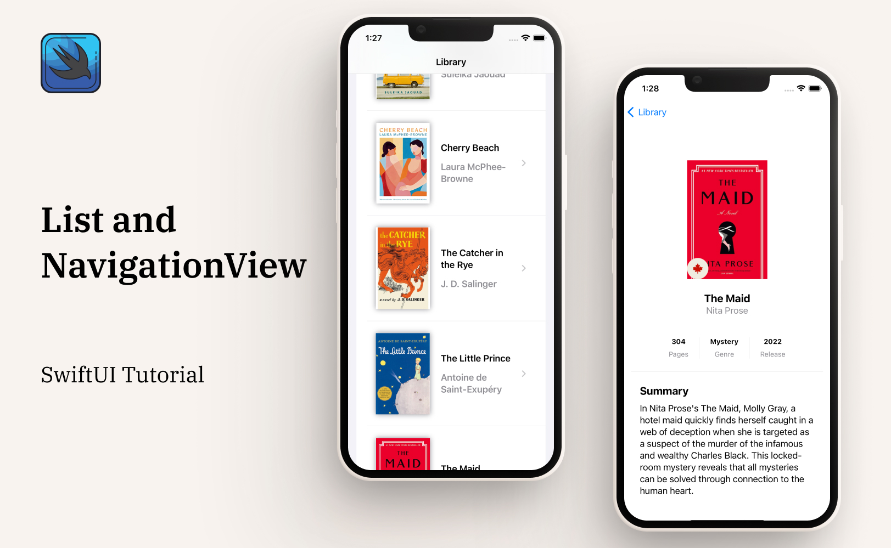
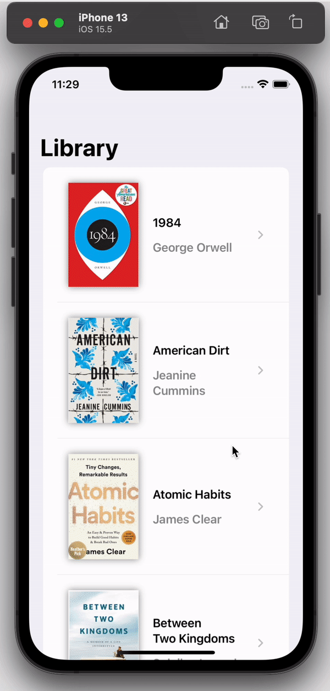

# List - SwiftUI Tutorial
List and NavigationView in SwiftUI

<h3 align="center">

</h3>

This is a simple navigation-based iOS app written in SwiftUI to practice List and NavigationView. The app shows a list of books which allows users to select a book from a list and navigate them to a different view showing its details, like so:

<h3 align="center">

</h3>
